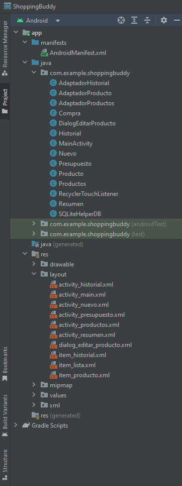

# Tu Amigo de Compras (Shopping Buddy)

## Descripción del Proyecto
Shopping Buddy es una aplicación móvil desarrollada en Android que permite a los usuarios gestionar sus compras y presupuestos de manera eficiente. La aplicación ofrece una interfaz de usuario intuitiva para agregar productos, calcular totales y realizar seguimiento de los gastos.

## Desarrolladora
[Alejandra Duarte](https://github.com/duarteale)

## Instalación y Configuración

### Requisitos Previos
- Android Studio instalado en tu sistema
- Un dispositivo Android para probar la aplicación
  
### Pasos para Instalar y Configurar
- Clona el repositorio del proyecto.
- Abre el proyecto en Android Studio.
- Configura el proyecto según sea necesario.

## Estructura del Proyecto
La aplicación está dividida en varias actividades y fragmentos, cada uno correspondiente a una funcionalidad específica.

## Archivos Importantes
- MainActivity.java: Actividad principal de la aplicación.
- Producto.java: Clase que representa un producto.
- AdaptadorProducto.java: Adaptador para la lista de productos.
  
## Desarrollo
Para desarrollar nuevas funcionalidades, sigue los siguientes pasos:
1. Crea una nueva actividad o fragmento según sea necesario.
2.  Agrega la lógica de negocio en la actividad o fragmento correspondiente.
3. Actualiza el adaptador y la lista de productos según sea necesario.

## Ejecución
Para ejecutar la aplicación, utiliza el botón "Run" en Android Studio o ejecuta el comando gradle assembleDebug en la terminal.

## Contribución
Agradecemos cualquier contribución al proyecto. Por favor, crea un fork del repositorio y envía una solicitud de pull con tus cambios.
